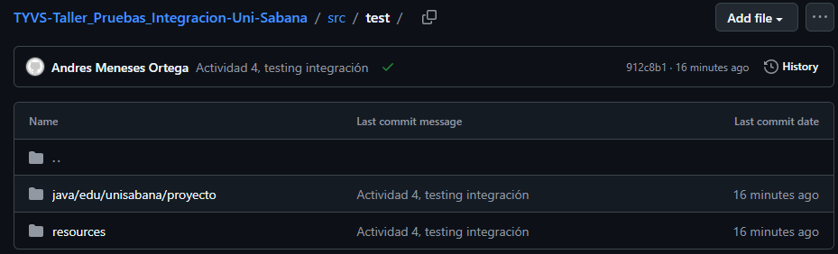
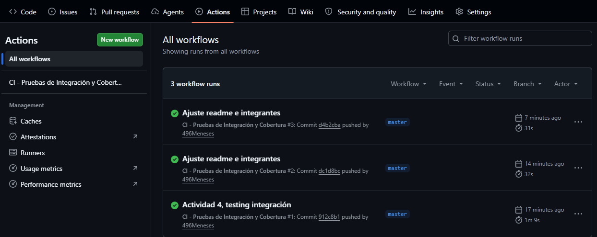
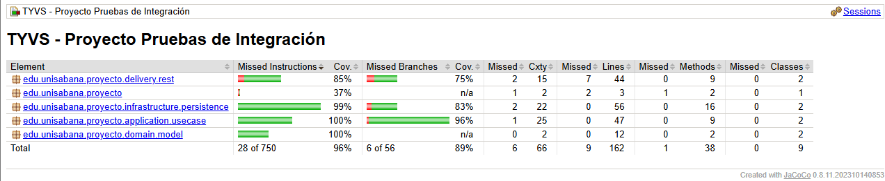
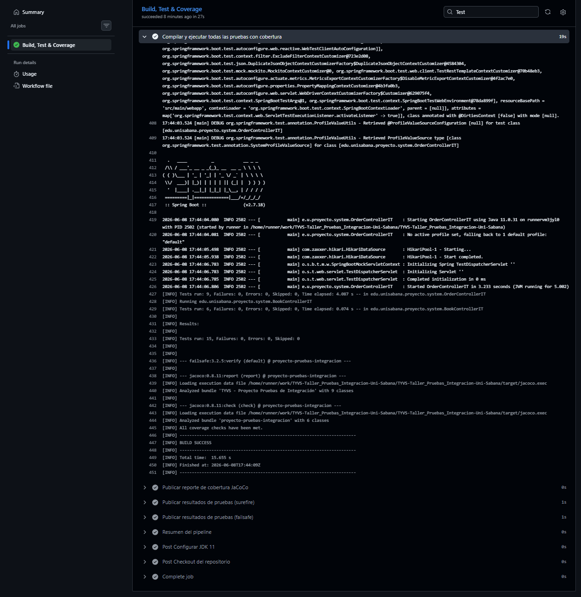
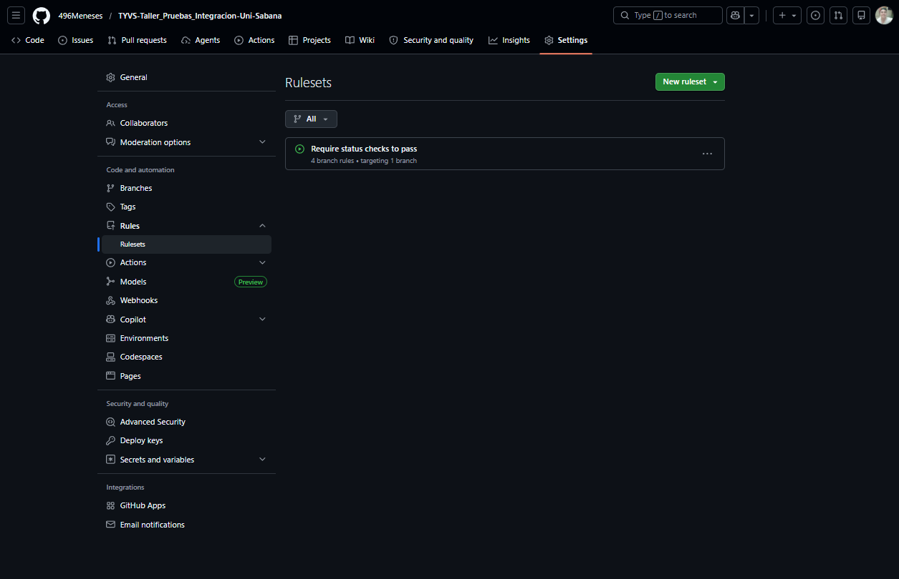

# TYVS - Proyecto Pruebas de Integracion

Sistema de Gestion de Pedidos de Libreria implementado con Clean Architecture, Spring Boot y H2.  
Curso: Testing y Validacion de Software — Universidad de La Sabana.

**Integrantes:** David Monsalve — Andres Meneses

## Descripcion del sistema

API REST que permite gestionar el catalogo de libros y los pedidos de clientes. Un pedido solo puede crearse si el libro existe, esta disponible y tiene stock suficiente. Al confirmar o cancelar un pedido se valida el estado actual antes de actualizar.


## Arquitectura

El proyecto sigue Clean Architecture con cuatro capas:

```
domain/model/          Entidades: Book, Order, OrderStatus, OrderResult
application/port/out/  Interfaces de repositorio (puertos de salida)
application/usecase/   Logica de negocio: BookService, OrderService
infrastructure/        Implementacion JDBC con JdbcTemplate sobre H2
delivery/rest/         Controladores REST: BookController, OrderController
```

La capa de aplicacion no conoce Spring ni H2; depende unicamente de interfaces, lo que permite sustituir la persistencia sin tocar la logica de negocio.


## Ejecucion

**Requisitos:** Java 11+, Maven 3.6+

```bash
# Compilar, ejecutar todas las pruebas y generar reporte de cobertura
mvn clean verify

# Solo pruebas unitarias e integracion (sin pruebas de sistema)
mvn test

# Reporte de cobertura
target/site/jacoco/index.html
```


## Pruebas

### Tipos implementados

| Tipo | Clase | Pruebas | Descripcion |
|------|-------|---------|-------------|
| Unitarias | BookServiceUnitTest | 11 | BookService con Mockito, sin BD |
| Unitarias | OrderServiceUnitTest | 13 | OrderService con Mockito, sin BD |
| Integracion H2 | BookServiceIntegrationTest | 7 | BookService con base de datos real en memoria |
| Integracion H2 | OrderServiceIntegrationTest | 10 | OrderService con base de datos real en memoria |
| Integracion Mock | OrderServiceMockTest | 8 | OrderService con dobles de prueba |
| Sistema HTTP | BookControllerIT | 6 | Endpoints REST con MockMvc y contexto Spring completo |
| Sistema HTTP | OrderControllerIT | 9 | Endpoints REST con MockMvc y contexto Spring completo |
| **Total** | | **64** | |

Todas las pruebas siguen el patron **Arrange-Act-Assert (AAA)**.

### Escenarios cubiertos

**BookService**
- Registro exitoso de libro valido
- Rechazo por titulo nulo o en blanco
- Rechazo por ID duplicado
- Actualizacion de stock (incluyendo stock = 0 que marca el libro como no disponible)
- Error al actualizar libro inexistente

**OrderService**
- Pedido exitoso con reduccion exacta de stock
- Rechazo por libro inexistente (BOOK_NOT_FOUND)
- Rechazo por stock insuficiente o libro no disponible (OUT_OF_STOCK)
- Confirmacion de pedido pendiente
- Cancelacion de pedido
- Rechazo por estado invalido (pedido ya confirmado o ya cancelado)
- Validaciones de entrada: nombre nulo/en blanco, cantidad <= 0

### Configuracion de pruebas

Las pruebas unitarias y de integracion sin Spring crean su propio `JdbcDataSource` con una base H2 nombrada independiente (`mem:bookservicetest`, `mem:orderservicetest`), garantizando aislamiento entre suites.

Las pruebas de sistema usan `@SpringBootTest` + `@AutoConfigureMockMvc` con la base `mem:testdb` definida en `src/test/resources/application.properties`. Cada clase limpia las tablas en `@Before` para garantizar independencia entre casos.


## Cobertura de codigo

Herramienta: JaCoCo 0.8.11

| Metrica | Minimo requerido | Resultado obtenido |
|---------|-----------------|-------------------|
| Cobertura de instrucciones | 75% | 96% |
| Cobertura de ramas | 70% | 89% |
| Cobertura de metodos | - | 97% |
| Cobertura de clases | - | 100% |

Las clases excluidas del analisis son los DTOs Lombok (`domain/model/**`) y la clase principal de Spring Boot (`ProyectoApplication`), ya que no contienen logica de negocio verificable.

El reporte HTML completo se genera en `target/site/jacoco/index.html` al ejecutar `mvn verify`.


## Pipeline CI/CD

Archivo: `.github/workflows/ci.yml`

El pipeline se activa en cada `push` y `pull_request` sobre cualquier rama. Ejecuta `mvn clean verify`, lo que incluye compilacion, pruebas unitarias (Surefire), pruebas de sistema (Failsafe) y verificacion de cobertura minima.

Si alguna prueba falla o la cobertura no alcanza el minimo, el pipeline falla y bloquea la integracion del codigo (requiere configurar Branch Protection Rules en GitHub: Settings > Branches > Require status checks).

Los artefactos generados en cada ejecucion son:
- `jacoco-coverage-report`: reporte HTML de cobertura
- `surefire-test-results`: resultados de pruebas unitarias e integracion
- `failsafe-test-results`: resultados de pruebas de sistema


## Defectos identificados

Ver archivo `defectos_integracion.md` para el registro completo con clasificacion, pasos de reproduccion y correcciones aplicadas.

Resumen:

| ID | Descripcion | Estado |
|----|-------------|--------|
| DEF-001 | Stock no se reducia al crear un pedido | Resuelto |
| DEF-002 | Libro con stock=0 permanecia marcado como disponible | Resuelto |
| DEF-003 | Confirmar pedido cancelado retorna 400 en lugar de 409 | Abierto |


## Evidencias del entregable

### Script de pruebas automatizadas

Estructura de pruebas por carpeta en el repositorio:



### Pipeline CI/CD funcional

Ejecucion exitosa del workflow en GitHub Actions:



### Metricas de cubrimiento de codigo

Reporte JaCoCo generado por el pipeline (96% instrucciones, 89% ramas):



### Reporte de resultados de ejecucion

Resumen de pruebas ejecutadas (64 pruebas, 0 fallos):



### Restriccion de integracion

Branch ruleset activo que bloquea merges si el pipeline falla:



## Conclusiones

Las pruebas de integracion con H2 permitieron detectar los defectos DEF-001 y DEF-002 antes de que llegaran a las pruebas de sistema, reduciendo el costo de correccion. La separacion en tres niveles (unitarias, integracion, sistema) facilita identificar en que capa se origina cada falla.

El pipeline CI/CD garantiza que ninguna integracion de codigo pueda omitir la ejecucion de las pruebas, lo que aumenta la confianza en el estado del repositorio en todo momento.

El principal reto fue gestionar el aislamiento entre suites de prueba que comparten una base H2 en memoria dentro del mismo proceso JVM, resuelto mediante bases nombradas distintas por suite y limpieza explicita de tablas en cada caso de prueba.
